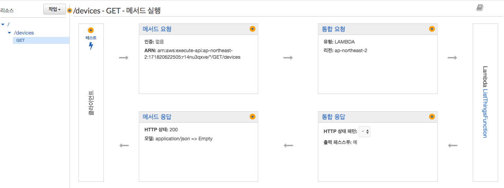
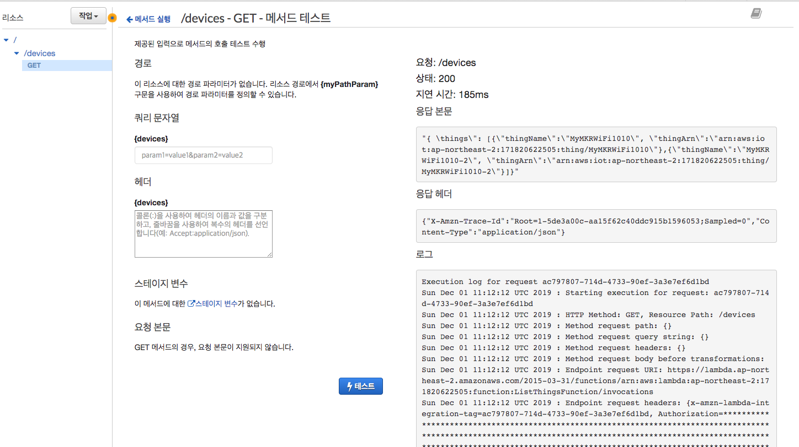
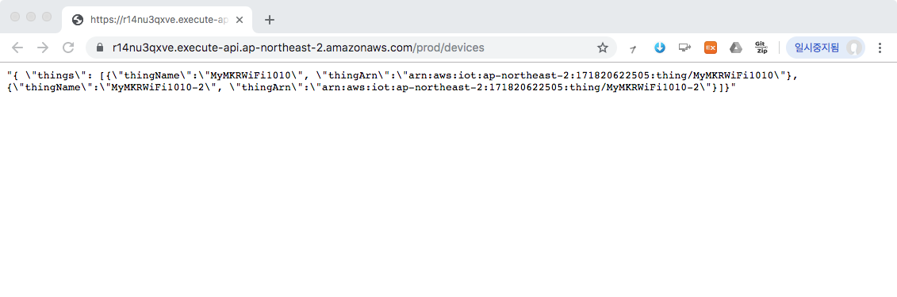

### 3.1 디바이스 목록 조회 REST API 구축하기
다음과 같은 API 요청과 API 응답을 가지는 REST API를 Lambda 함수와 API Gateway를 이용하여 구축해본다.

- API 요청
	
	```	
	GET /devices
	```
	
- API 응답

	```json
	{
		"things": [ 
		     { 
		    	"thingName": "string",
		      	"thingArn": "string"
		     }, 
		     ...
		   ]
	}
	```

--
#### 1단계: AWS Toolkit을 통해 Lambda 함수 생성
1. 다음 정보를 바탕으로 AWS Lambda 프로젝트를 Eclipse용 AWS Toolkit을 이용하여 생성한다.
	- **Project name**: *ListingDeviceLambdaJavaProject*
	- **Class Name**: *ListingDeviceHandler*
	- **Input Type**에서 *Custom*을 선택합니다. 
2. 생성된 *ListingDeviceLambdaJavaProject*의 **pom.xml** 파일을 열고, \<dependencies> 태그 안에 **aws-java-sdk-iot**에 대한 의존성을 추가한 후에, 파일을 **저장**합니다.

	```xml
	  <dependencies>
	    ...    
	    <dependency>
		  <groupId>com.amazonaws</groupId>
		  <artifactId>aws-java-sdk-iot</artifactId>
		</dependency>
		
	  </dependencies>
	```

3. Eclipse 프로젝트 탐색기를 사용하여 *ListingDeviceLambdaJavaProject* 프로젝트에서 *ListingDeviceHandler.java*를 열고, 다음 코드로 바꿉니다.

	```java
	import java.util.List;
	import com.amazonaws.services.iot.AWSIot;
	import com.amazonaws.services.iot.AWSIotClientBuilder;
	import com.amazonaws.services.iot.model.ListThingsRequest;
	import com.amazonaws.services.iot.model.ListThingsResult;
	import com.amazonaws.services.iot.model.ThingAttribute;
	import com.amazonaws.services.lambda.runtime.Context;
	import com.amazonaws.services.lambda.runtime.RequestHandler;
	
	public class ListingDeviceHandler implements RequestHandler<Object, String> {
		
	    @Override
	    public String handleRequest(Object input, Context context) {
	    	
	    	// AWSIot 객체를 얻는다. 
	    	AWSIot iot = AWSIotClientBuilder.standard().build();
	        
	    	// ListThingsRequest 객체 설정. 
	        ListThingsRequest listThingsRequest = new ListThingsRequest();
	        
	        // listThings 메소드 호출하여 결과 얻음. 
	        ListThingsResult result = iot.listThings(listThingsRequest);
	       
	        // result 객체로부터 API 응답모델 문자열 생성하여 반
	        return getResponse(result);
	    }
	    
	    /**
	     * ListThingsResult 객체인 result로 부터 ThingName과 ThingArn을 얻어서 Json문자 형식의
	     * 응답모델을 만들어 반환한다.
	     * {
	     * 	"things": [ 
	     *	     { 
	     *			"thingName": "string",
	     *	      	"thingArn": "string"
	     *	     },
	     *		 ...
	     *	   ]
	     * }
	     */
	    private String getResponse(ListThingsResult result) {
	    	List<ThingAttribute> things = result.getThings();
	        
	        String response = "{ \"things\": [";
	        for (int i =0; i<things.size(); i++) {
	        	if (i!=0) 
	        		response +=",";
	        	response += String.format("{\"thingName\":\"%s\", \"thingArn\":\"%s\"}", 
	        										things.get(i).getThingName(),
	        										things.get(i).getThingArn());
	        	
	        }
	        response += "]}";
	        return response;
	    }
	   
	}
	```
4. **Lambda에 함수를 업로드하려면**, Eclipse 코드 창에서 마우스 오른쪽 버튼을 클릭하고 **[AWS Lambda]**와 **[Upload function to AWS Lambda]**를 차례대로 선택합니다.
5. **[Select Target Lambda Function]** 페이지에서 사용할 AWS 리전을 선택합니다. 이 리전은 Amazon S3 버킷에 대해 선택한 리전과 동일해야 합니다.
6. 새 Lambda 함수 생성을 선택하고 함수 이름(예: *ListThingsFunction*)을 입력한 후, [**Next**]를 선택합니다.
7. **함수 구성(Function Configuration** 페이지에서 대상 Lambda 함수에 대한 설명을 입력하고 함수에서 사용할 **IAM 역할 선택**합니다.
	- 사용할 역할은 **AWSIoTFullAccess** 정책이 연결되어 있어야 합니다. 만약 이러한 역할이 없다면, IAM 콘솔을 통해 해당 역할을 생성합니다.
		- 다음 [링크](https://docs.aws.amazon.com/ko_kr/lambda/latest/dg/lambda-intro-execution-role.html)를 통해 역할 생성에 대해서 자세히 살펴보세요.
8. Lambda 함수 코드를 저장할 S3 버킷을 선택합니다. 만약 새로운 Amazon S3 버킷을 생성하고 싶은 경우에는 **생성** 버튼을 클릭하고 버킷 생성 대화 상자에 버킷 이름을 입력합니다.
9. **Finish**를 선택하여 Lambda 함수를 AWS에 업로드합니다. 
10. **Lambda 함수를 실행하려면**, Eclipse 코드 창에서 마우스 오른쪽 버튼을 클릭하고 AWS Lambda를 선택한 후 **Run Function on AWS Lambda**(AWS Lambda에서 함수 실행)를 선택합니다. 
11. **Invoke** 버튼을 클릭한 후, **Eclipse Console** 창에 다음과 같은 결과가 출력되는 지 확인합니다.

	```
	Skip uploading function code since no local change is found...
	Invoking function...
	==================== FUNCTION OUTPUT ====================
	"{ \things\": [{\"thingName\":\"MyMKRWiFi1010\", \"thingArn\":\"arn:aws:iot:ap-northeast-2:171820622505:thing/MyMKRWiFi1010\"},{\"thingName\":\"MyMKRWiFi1010-2\", \"thingArn\":\"arn:aws:iot:ap-northeast-2:171820622505:thing/MyMKRWiFi1010-2\"}]}"
	==================== FUNCTION LOG OUTPUT ====================
	START RequestId: a0e3a9ed-38fd-499d-af48-a9cbb03fbe2c Version: $LATEST
	END RequestId: a0e3a9ed-38fd-499d-af48-a9cbb03fbe2c
	REPORT RequestId: a0e3a9ed-38fd-499d-af48-a9cbb03fbe2c	Duration: 173.25 ms	Billed Duration: 200 ms	Memory Size: 512 MB	Max Memory Used: 129 MB
	``` 

--	
#### 2단계 API Gateway 콘솔에서 REST API 생성

1. [API Gateway 콘솔](https://ap-northeast-2.console.aws.amazon.com/apigateway/)로 이동합니다.
2. **API 생성**을 선택합니다.
3. **API 유형 선택**에서 *REST API*의 **구축**를 클릭합니다.
4. **새 API 생성**에서 *새 API*를 선택합니다.
5. **이름 및 설명** 설정에서 다음과 같이 합니다.
	- **API 이름**에 *my-device-api*를 입력합니다.
	- 필요한 경우 **설명** 필드에 설명을 입력합니다. 설명을 입력하지 않으려면 비워 둡니다.
	- **엔드포인트 유형** 설정을 *지역*으로 그대로 둡니다.
6. **API 생성(Create API)**을 선택합니다.
7. **리소스** 아래에 **/** 이외에는 아무 것도 보이지 않을 것입니다. 이는 API의 기본 경로 URL에 해당하는 루트 수준 리소스입니다.
8. **리소스** 아래에서 **/**를 선택합니다.
9. **작업** 드롭다운 메뉴에서 **리소스 생성**을 선택합니다.
10. **리소스** 이름에 *devices*를 입력합니다. 
11. **리소스 생성**을 선택합니다.
12. **작업** 드롭다운 메뉴에서 **메소드 생성**을 선택합니다.
13. 리소스 이름(**/devices**) 아래에 드롭다운 메뉴가 보일 것입니다. **GET**을 선택한 후 **확인 표시 아이콘**(체크)을 선택하여 선택 사항을 저장합니다.
14. **/devices – GET – 설정** 창의 **통합 유형**에서 *Lambda 함수*를 선택합니다.
15. **Lambda 리전**에서 Lambda 함수를 생성한 리전을 선택합니다.
16. **Lambda 함수** 필드에 문자를 입력한 후 드롭다운 메뉴에서 *ListThingsFunction*을 선택합니다.  **저장**을 선택하여 선택 사항을 저장합니다
17. **Lambda 함수에 대한 권한 추가** 팝업이 나타나면(**Lambda 함수를 호출하기 위해 API Gateway에 권한을 부여하려고 합니다....**”), 확인을 선택하여 API Gateway에 해당 권한을 부여합니다.
	- 이제 **/ – GET – 메소드 실행** 창이 보일 것입니다.

	
18. **클라이언트** 부분의 **테스트**를 클릭합니다.
19. 아무 입력 없이 **테스트**버튼을 클릭하여 다음과 같은 결과가 나오는 지 확인합니다.

	
	
--
#### 3단계: CORS 활성환 및 API Gateway 콘솔에서 REST API 배포


JavaScript는 **Cross-Origin Resource Sharing (CORS)** 요청을 기본적으로 제한합니다. 즉, JavaScript 코드가 동일 서버 내의 리소스를 접근하는 것은 허용하지만, 다른 서버의 리소스를 사용하고자 하는 경우에는 CORS 헤더 정보가 포함되어 있어야 합니다. 

- 더 자세한 정보는 https://developer.mozilla.org/ko/docs/Web/HTTP/Access_control_CORS 참조

**REST API 리소스에 대해 CORS 지원 활성화**

1. 리소스에서 **/devices**를 선택합니다. 그렇게 하면 해당 리소스 상의 모든 메서드에 대해 CORS가 활성화됩니다.
2. **작업** 드롭다운 메뉴에서 **CORS 활성화(Enable CORS)**를 선택합니다.
3. **CORS 활성화 및 기존의 CORS 헤더 대체**를 선택합니다.
4. **메서드 변경사항 확인** 창에서 **예, 기존 값을 대체하겠습니다.**를 선택합니다.

2단계를 완료하면 API를 생성했지만 아직 실제로 사용할 수는 없습니다. 배포해야 하기 때문입니다.

1. **작업** 드롭다운 메뉴에서 **Deploy API(API 배포)**를 선택합니다.
2. **배포 스테이지** 드롭다운 메뉴에서 **[새 스테이지]**를 선택합니다.
3. **스테이지 이름**에 *prod*를 입력합니다.
4. **배포**을 선택합니다.


--
#### 4단계: REST API 테스트
1. **prod 스테이지 편집기**의 맨 위에 있는 **호출 URL**을 적어 둡니다.
2. 웹 브라우저 주소창에 *"호출 URL/devices"*을 입력한 후 엔터를 쳐 봅니다.
	- 이번 REST API는 GET 메소드만을 이용한 것이므로, 웹 브라우저에서도 테스트가 가능하지만, 일반적으로 API 테스트는 [cURL](https://curl.haxx.se/) 또는 [POSTMAN](https://www.getpostman.com/) 등의 도구를 사용합니다
	
	
3. [2.1](api-gateway.html##2.1)절에서 정의한 응답모델과 동일한 형식의 JSon 문자열이 반환된 것을 확인할 수 있습니다.

#### 5 단계: REST API 활용한 JavaScript 기반 웹 프로그래밍
<!--
- JavaScript는 **Cross-Origin Resource Sharing (CORS)** 요청을 기본적으로 제한합니다. 즉, JavaScript 코드가 동일 서버 내의 리소스를 접근하는 것은 허용하지만, 다른 서버의 리소스를 사용하고자 하는 경우에는 CORS 헤더 정보가 포함되어 있어야 합니다. 
	- 더 자세한 정보는 https://developer.mozilla.org/ko/docs/Web/HTTP/Access_control_CORS 참조
- 따라서, [API Gateway 콘솔을 사용하여 리소스에서 CORS 활성화
](https://docs.aws.amazon.com/ko_kr/apigateway/latest/developerguide/how-to-cors.html#how-to-cors-console) 절차에 따라서 **CORS**를 활성화 해야 합니다.
	1. https://console.aws.amazon.com/apigateway 에서 API Gateway 콘솔에 로그인합니다.
	2. API 목록에서 API를 선택합니다.
	3. 리소스에서 리소스를 선택합니다. 그렇게 하면 리소스 상의 모든 메서드에 대해 CORS가 활성화됩니다.
	4. 작업 드롭다운 메뉴에서 **CORS 활성화(Enable CORS)**를 선택합니다.
	5. **CORS 활성화 및 기존의 CORS 헤더 대체(Enable CORS and replace existing CORS headers)**를 선택합니다. 	
	6. **메소드 변경사항 확인** 창에서 **예, 기존 값을 대체하겠습니다.** 를 선택합니다.
	7. **작업** 드롭다운 메뉴에서 **Deploy API(API 배포)**를 선택합니다.
	8. **배포 스테이지** 드롭다운 메뉴에서 **prod**를 선택합니다.
	9. **배포**을 선택합니다.
-->
- **나의 디바이스 목록 조회**
	- **list\_devices.html** 시작 html 페이지
	
		```html
		<!DOCTYPE html>
		<html lang="en">
		    <head>
		        <meta charset="UTF-8">
		        <title>AWS Open API Sample</title>
		
		        <!-- JQuery 라이브러리 설정 -->
		        <script src="https://code.jquery.com/jquery-3.4.1.min.js" integrity="sha256-CSXorXvZcTkaix6Yvo6HppcZGetbYMGWSFlBw8HfCJo=" crossorigin="anonymous"></script>
		
		        <!-- 디바이스 조회 자바스크립트 로딩-->
		        <script src="list_devices.js"></script>
		    </head>
		    <body>
		        <h3>My AWS API Sample</h3>
		
		
		        <h4> 나의 디바이스 목록 <input type="button" value="조회" onclick="Start();" />
		        </h4>
		
		        <table id="mytable">
		            <thead style="background-color:lightgrey">
		                <th>디바이스 명</th>
		                <th>디바이스 ARN</th>     
		            </thead>
		            <tbody> </tbody>
		        </table>
		  
		        <div id="result">No Data</div>
		    </body>
		</html>
	```
	- **list\_devices.js**: JQuery 기반 Javascript 코드 

		```javascript
		// API 시작
		function Start() {
		    invokeAPI();
		    emptyTable();
		}
		
		var invokeAPI = function() {
		
		    // 디바이스 조회 URI
		    // prod 스테이지 편집기의 맨 위에 있는 "호출 URL/devices"로 대체해야 함
		    var API_URI = 'https://XXXXXXXXXX.execute-api.ap-northeast-2.amazonaws.com/prod/devices'; 		        
		    $.ajax(API_URI, {
		        method: 'GET',
		        contentType: "application/json",
		        
		        
		        success: function (data, status, xhr) {
		
		            var result = JSON.parse(data);
		            setDataList(result.things);  // 성공시, 데이터 출력을 위한 함수 호출
		            console.log(data);
		        },
		        error: function(xhr,status,e){
		          //  document.getElementById("result").innerHTML="Error";
		            alert("error");
		        }
		    });
		};
		
		// 테이블 데이터 삭제
		var emptyTable = function() {
		    $( '#mytable > tbody').empty();
		    document.getElementById("result").innerHTML="조회 중입니다.";
		}
		
		// 데이터 출력을 위한 함수
		var setDataList = function(data){
		
		    $( '#mytable > tbody').empty();
		    data.forEach(function(v){
		
		        var tr1 = document.createElement("tr");
		        var td1 = document.createElement("td");
		        var td2 = document.createElement("td");
		        td1.innerText = v.thingName;
		        td2.innerText = v.thingArn;
		        tr1.appendChild(td1);
		        tr1.appendChild(td2);
		        $("table").append(tr1);
		    })
		
		    if(data.length>0){
		            // 디바이스 목록 조회결과가 있는 경우 데이터가 없습니다 메시지 삭제
		        document.getElementById("result").innerHTML="";
		    } else if (data.length ==0) {
		        document.getElementById("result").innerHTML="No Data";
		    }
	}
	```	
- **실행 화면**
	- 초기화면 

		
		
	- **조회** 버튼을 클릭한 후
	
		
