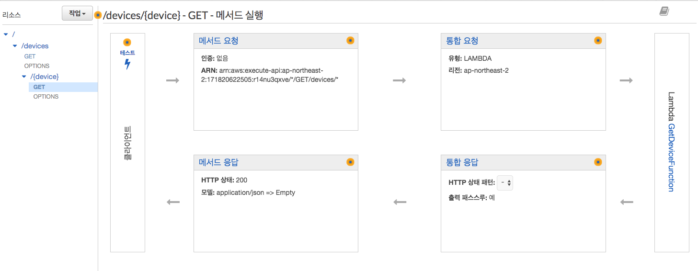
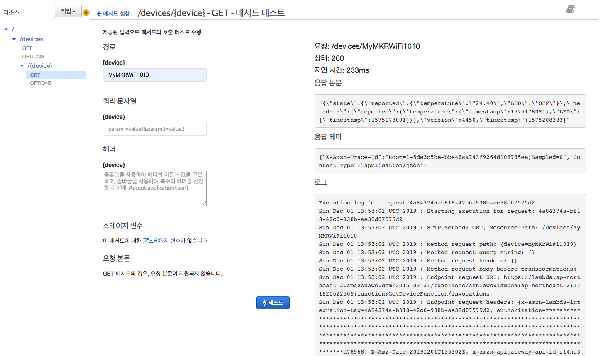
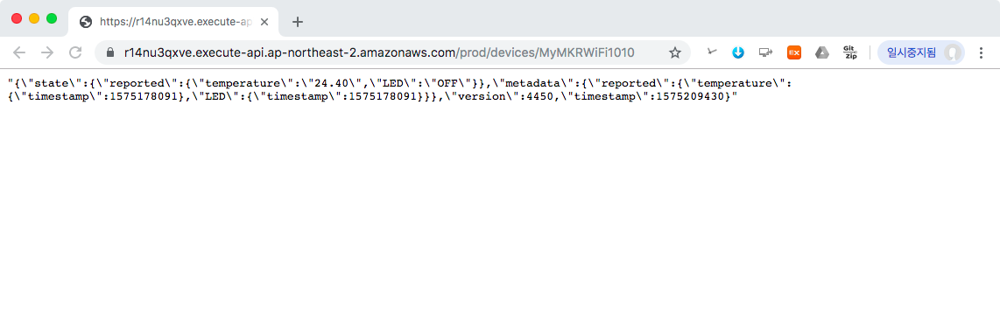

### 3.2 디바이스 상태 조회 REST API 구축하기
다음과 같은 API 요청과 API 응답을 가지는 REST API를 Lambda 함수와 API Gateway를 이용하여 구축해본다.

- API 요청
	
	```	
	GET /devices/{deviceId}
	```
	
- 응답 모델
	- [GetThingShadow](https://docs.aws.amazon.com/ko_kr/iot/latest/developerguide/API_GetThingShadow.html)의 [응답 상태 문서](https://docs.aws.amazon.com/ko_kr/iot/latest/developerguide/device-shadow-document.html#device-shadow-example-response-json) 
		
		```json
		{
		    "state": {
		        "desired": {
		            "attribute1": integer2,
		            "attribute2": "string2",
		            ...
		            "attributeN": boolean2
		        },
		        "reported": {
		            "attribute1": integer1,
		            "attribute2": "string1",
		            ...
		            "attributeN": boolean1
		        },
		        "delta": {
		            "attribute3": integerX,
		            "attribute5": "stringY"
		        }
		    },
		    "metadata": {
		        "desired": {
		            "attribute1": {
		                "timestamp": timestamp
		            },
		            "attribute2": {
		                "timestamp": timestamp
		            },
		            ...
		            "attributeN": {
		                "timestamp": timestamp
		            }
		        },
		        "reported": {
		            "attribute1": {
		                "timestamp": timestamp
		            },
		            "attribute2": {
		                "timestamp": timestamp
		            },
		            ...
		            "attributeN": {
		                "timestamp": timestamp
		            }
		        }
		    },
		    "timestamp": timestamp,
		    "clientToken": "token",
		    "version": version
		}
		```
		
--
#### 1단계: AWS Toolkit을 통해 Lambda 함수 생성
1. 다음 정보를 바탕으로 AWS Lambda 프로젝트를 Eclipse용 AWS Toolkit을 이용하여 생성한다.
	- **Project name**: *GetDeviceLambdaJavaProject*
	- **Class Name**: *GetDeviceHandler*
	- **Input Type**에서 *Custom*을 선택합니다. 
2. 생성된 *GetDeviceLambdaJavaProject*의 **pom.xml** 파일을 열고, \<dependencies> 태그 안에 **aws-java-sdk-iot**에 대한 의존성을 추가한 후에, 파일을 **저장**합니다.

	```xml
	  <dependencies>
	    ...    
	    <dependency>
		  <groupId>com.amazonaws</groupId>
		  <artifactId>aws-java-sdk-iot</artifactId>
		</dependency>
		
	  </dependencies>
	```

3. Eclipse 프로젝트 탐색기를 사용하여 *GetDeviceLambdaJavaProject* 프로젝트에서 *GetDeviceHandler.java*를 열고, 다음 코드로 바꿉니다.

	```java
	import com.amazonaws.services.iotdata.AWSIotData;
	import com.amazonaws.services.iotdata.AWSIotDataClientBuilder;
	import com.amazonaws.services.iotdata.model.GetThingShadowRequest;
	import com.amazonaws.services.lambda.runtime.Context;
	import com.amazonaws.services.lambda.runtime.RequestHandler;
	
	public class GetDeviceHandler implements RequestHandler<Event, String> {
		
	    @Override
	    public String handleRequest(Event event, Context context) {
	    	AWSIotData iotData = AWSIotDataClientBuilder.standard().build();
	        
	        GetThingShadowRequest getThingShadowRequest  = 
			new GetThingShadowRequest()
				.withThingName(event.device);
	        
	        iotData.getThingShadow(getThingShadowRequest);
	     
	        return new String(iotData.getThingShadow(getThingShadowRequest).getPayload().array());
	    }
	}
	
	class Event {
		public String device;
	}
```
4. **Lambda에 함수를 업로드하려면**, Eclipse 코드 창에서 마우스 오른쪽 버튼을 클릭하고 **[AWS Lambda]**와 **[Upload function to AWS Lambda]**를 차례대로 선택합니다.
5. **[Select Target Lambda Function]** 페이지에서 사용할 AWS 리전을 선택합니다. 이 리전은 Amazon S3 버킷에 대해 선택한 리전과 동일해야 합니다.
6. 새 Lambda 함수 생성을 선택하고 함수 이름(예: *GetDeviceFunction*)을 입력한 후, [**Next**]를 선택합니다.
7. **함수 구성(Function Configuration** 페이지에서 대상 Lambda 함수에 대한 설명을 입력하고 함수에서 사용할 **IAM 역할 선택**합니다.
	- 사용할 역할은 **AWSIoTFullAccess** 정책이 연결되어 있어야 합니다. 만약 이러한 역할이 없다면, IAM 콘솔을 통해 해당 역할을 생성합니다.
		- 다음 [링크](https://docs.aws.amazon.com/ko_kr/lambda/latest/dg/lambda-intro-execution-role.html)를 통해 역할 생성에 대해서 자세히 살펴보세요.
8. Lambda 함수 코드를 저장할 S3 버킷을 선택합니다. 만약 새로운 Amazon S3 버킷을 생성하고 싶은 경우에는 **생성** 버튼을 클릭하고 버킷 생성 대화 상자에 버킷 이름을 입력합니다.
9. **Finish**를 선택하여 Lambda 함수를 AWS에 업로드합니다. 
10. **Lambda 함수를 실행하려면**, Eclipse 코드 창에서 마우스 오른쪽 버튼을 클릭하고 AWS Lambda를 선택한 후 **Run Function on AWS Lambda**(AWS Lambda에서 함수 실행)를 선택합니다. 
11. **Enter the JSON input for your function**이 선택된 상태에서 입력 창에 다음 입력 문자열을 입력한다.
	- 조회할 사물의 이름이 *MyMKRWiFi1010*인 경우를 가정

	```JSON
	{
		"device" : "MyMKRWiFi1010"
	}
	```
11. **Invoke** 버튼을 클릭한 후, **Eclipse Console** 창에 다음과 같은 결과가 출력되는 지 확인합니다.

	```
	Skip uploading function code since no local change is found...
Invoking function...
==================== FUNCTION OUTPUT ====================
"{\"state\":{\"reported\":{\"temperature\":\"24.40\",\"LED\":\"OFF\"}},\"metadata\":{\"reported\":{\"temperature\":{\"timestamp\":1575178091},\"LED\":{\"timestamp\":1575178091}}},\"version\":4450,\"timestamp\":1575206310}"
==================== FUNCTION LOG OUTPUT ====================
START RequestId: 0287aaca-379a-4467-ae0f-fdb0f01ac7cf Version: $LATEST
END RequestId: 0287aaca-379a-4467-ae0f-fdb0f01ac7cf
REPORT RequestId: 0287aaca-379a-4467-ae0f-fdb0f01ac7cf	Duration: 7100.97 ms	Billed Duration: 7200 ms	Memory Size: 512 MB	Max Memory Used: 139 MB	Init Duration: 331.18 ms	
	``` 

--	
#### 2단계 API Gateway 콘솔에서 REST API 생성
1. [API Gateway 콘솔](https://ap-northeast-2.console.aws.amazon.com/apigateway/)로 이동합니다.
2. 이전에 생성한 *my-device-api*를 선택합니다.
3. 리소스 이름(**/devices**)을 선택합니다. 
4. **작업** 드롭다운 메뉴에서 **리소스 생성**을 선택합니다.
5. **리소스 이름**에 *device*를 입력합니다. 
6. **리소스 경로(Resource Path)**를 *{device}*로 바꿉니다. 이는 클라이언트에서 입력을 가져오는데 사용되는 템플릿 경로 변수로서, 나중에 이 경로 변수를 매핑 템플릿을 사용하여 Lambda 함수 입력에 매핑하는 방법을 보여줍니다.
7. **API Gateway Cors** 활성화 옵션을 선택합니다.
8. **리소스 생성**을 클릭합니다.
9. 새로 생성된 /{device} 리소스가 강조 표시되면 **작업**에서 **메서드 생성(Create Method)**을 선택합니다.
10. 리소스 이름 (/{devices}) 아래에 드롭다운 메뉴가 보일 것입니다. **GET**을 선택한 후 **확인 표시 아이콘**(체크)을 선택하여 선택 사항을 저장합니다.
11. **/devices/{device} – GET – 설정** 창의 **통합 유형**에서 *Lambda 함수*를 선택합니다.
12. **Lambda 프록시 통합 사용** 상자를 **선택하지 않은 상태**로 놔둡니다.
13. **Lambda 리전**에서 Lambda 함수를 생성한 리전을 선택합니다.
14. **Lambda 함수** 필드에 문자를 입력한 후 드롭다운 메뉴에서 *GetDeviceFunction*을 선택합니다.  **저장**을 선택하여 선택 사항을 저장합니다
15. **Lambda 함수에 대한 권한 추가** 팝업이 나타나면(**Lambda 함수를 호출하기 위해 API Gateway에 권한을 부여하려고 합니다....**”), 확인을 선택하여 API Gateway에 해당 권한을 부여합니다.
	- 이제 **/devices/{device} – GET – 메소드 실행** 창이 보일 것입니다.

	
16. **/{device}**의 GET 메서드를 선택하고 **통합 요청(Integration Request)**을 선택하여 본문 매핑 템플릿을 설정합니다.	
17. **매핑 템플릿(Mapping Templates)** 섹션을 확장합니다. **매핑 템플릿 추가(Add mapping template)**를 선택합니다. **Content-Type**에 *application/json*을 입력합니다. 확인 표시 아이콘을 선택하여 설정을 저장합니다.
	- 나타나는 팝업에서 **예, 이 통합 보호(Yes, secure this integration)**를 선택합니다.
18. **요청 본문 패스스루(Request body passthrough)**에 권장되는 **정의된 템플릿이 없는 경우(권장)**를 선택합니다.
19. 템플릿 생성(Generate template)아래 편집기에 다음을 입력합니다.

	```
	{
	  "device": "$input.params('device')"
	}
	```
	- 이는 Lambda 함수에 전달될 payload를 구성하는 템플릿으로서, "device" 속성 값을 /{device} 경로변수의 값으로 사용하겠다는 의미입니다. 
20. **저장**을 선택합니다.
21. **/devices/{device} – GET – 메소드 실행** 창으로 이동하여, **클라이언트** 부분의 **테스트**를 클릭합니다.
22. {device} 경로에 본인이 만든 사물 이름(예, *MyMKRWiFi1010*)을 입력합니다. 
23. **테스트**버튼을 클릭하여 다음과 같은 결과가 나오는 지 확인합니다.

	

--
#### 3단계: CORS 활성환 및 API Gateway 콘솔에서 REST API 배포
REST API 리소스에 대해 CORS 지원 활성화

1. 리소스에서 **/devices**를 선택합니다. 그렇게 하면 리소스 상의 모든 메서드에 대해 CORS가 활성화됩니다.
2. **작업** 드롭다운 메뉴에서 **CORS 활성화(Enable CORS)**를 선택합니다.
3. **CORS 활성화 및 기존의 CORS 헤더 대체**를 선택합니다.
4. **메서드 변경사항 확인** 창에서 **예, 기존 값을 대체하겠습니다.**를 선택합니다.

2단계를 완료하면 API를 생성했지만 아직 실제로 사용할 수는 없습니다. 배포해야 하기 때문입니다.

1. **작업** 드롭다운 메뉴에서 **Deploy API(API 배포)**를 선택합니다.
2. **배포 스테이지** 드롭다운 메뉴에서 **prod**를 선택합니다.
4. **배포**을 선택합니다.

--
#### 4단계: REST API 테스트
1. **prod 스테이지 편집기**의 맨 위에 있는 **호출 URL**을 적어 둡니다.
2. 웹 브라우저 주소창에 *"호출 URL/devices/MyMKRWiFi1010"*을 입력한 후 엔터를 쳐 봅니다.
	- 이번 REST API는 GET 메소드만을 이용한 것이므로, 웹 브라우저에서도 테스트가 가능하지만, 일반적으로 API 테스트는 [cURL](https://curl.haxx.se/) 또는 [POSTMAN](https://www.getpostman.com/) 등의 도구를 사용합니다
	
	
	
3. [2.2](api-gateway.html#2.2)절에서 정의한 응답모델과 동일한 형식의 JSon 문자열이 반환된 것을 확인할 수 있습니다.

--
#### 5 단계: REST API 활용한 JavaScript 기반 웹 프로그래밍
- **나의 디바이스 목록 조회**
	- **get\_device\_state.html** 시작 html 페이지
	
		```html
		<!DOCTYPE html>
		<html lang="en">
		    <head>
		        <meta charset="UTF-8">
		        <title>AWS Open API Sample</title>
		
		        <!-- JQuery 라이브러리 설정 -->
		        <script src="https://code.jquery.com/jquery-3.4.1.min.js" integrity="sha256-CSXorXvZcTkaix6Yvo6HppcZGetbYMGWSFlBw8HfCJo=" crossorigin="anonymous"></script>
		
		        <!-- 디바이스 조회 자바스크립트 로딩-->
		        <script src="device_state.js"></script>
		    </head>
		    <body>
		        <h3>My AWS API Sample</h3>
		
		 
		        
		        <input type="button" value="조회 시작" onclick="Start();" />
		        <input type="button" value="조회 중지" onclick="Stop();" />
		        
		        <h4>나의 디바이스 최신 상태</h4>
		        
		        <div id="result">No Data</div>
		    </body>
		</html>
		```
	- **device_state.js**: JQuery 기반 Javascript 코드 

		```javascript
		// 중지를 위해 ID 보관
		var intervalId = null;
		
		// API 시작
		function Start() {
		    invokeAPI();
		    intervalId = setInterval(invokeAPI, 1000);
		    document.getElementById("result").innerHTML="조회 중...";
		}
		// API 중지
		
		function Stop() {
		    if(intervalId != null) {
		        clearInterval(intervalId);
		        document.getElementById("result").innerHTML="No Data";
		    }
		}
		
		var invokeAPI = function() {
		    // 디바이스 조회 URI
		    // prod 스테이지 편집기의 맨 위에 있는 "호출 URL/devices"로 대체해야 함
		    var API_URI = 'https://XXXXXXXXXX.execute-api.ap-northeast-2.amazonaws.com/prod/devices/MyMKRWiFi1010'; 		        
		    $.ajax(API_URI, {
		        method: 'GET',
		        contentType: "application/json",
		
		        success: function (data, status, xhr) {
		                var result = JSON.parse(data);
		                printData(result);  // 성공시, 데이터 출력을 위한 함수 호출
		               
		                console.log("data="+data);
		        },
		        error: function(xhr,status,e){
		                alert("error");
		        }
		    });
		};
		
		
		    
		// 데이터 출력을 위한 함수
		var printData = function(result){      
		    document.getElementById("result").innerHTML = "temp: "+ result.state.reported.temperature +  
		                                                ", LED: " + result.state.reported.LED;
		}
	```	
- **실행 화면**
	- 초기화면 

		
		
	- **조회** 버튼을 클릭한 후
	
		
