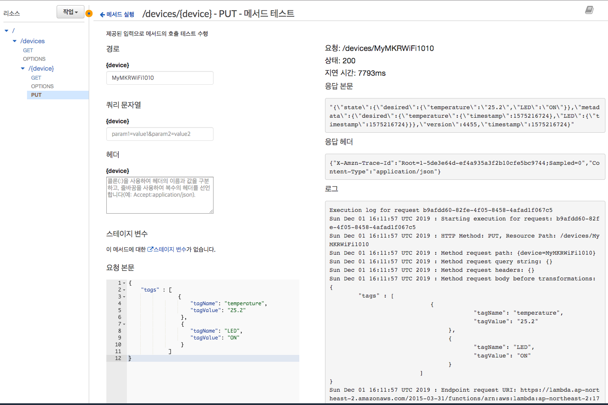
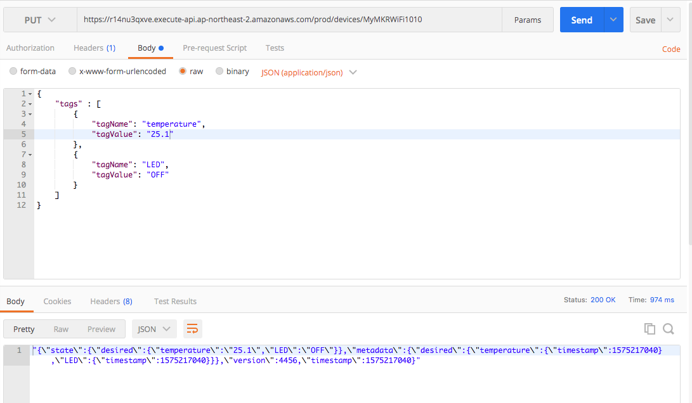

### 3.3 디바이스 상태 변경 REST API 구축하기
- API 요청

	```		
	PUT /devices/{deviceID}
	```	
	- payload 
	
		```json
		{ 
			"tags" : [
				{
					"attrName": "temperature",
					"attrValue": "27.0"
				},
				{
					"attrName": "LED",
					"attrValue": "OFF"
				}
			]
		}
		```		

- API 응답
	- [UpdateThingShadow](https://docs.aws.amazon.com/ko_kr/iot/latest/developerguide/API_UpdateThingShadow.html)의 [응답 상태 문서](https://docs.aws.amazon.com/ko_kr/iot/latest/developerguide/device-shadow-document-syntax.html#device-shadow-example-response-json) 

--
#### 1단계: AWS Toolkit을 통해 Lambda 함수 생성
1. 다음 정보를 바탕으로 AWS Lambda 프로젝트를 Eclipse용 AWS Toolkit을 이용하여 생성한다.
	- **Project name**: *UpdateDeviceLambdaJavaProject*
	- **Class Name**: *UpdateDeviceHandler*
	- **Input Type**에서 *Custom*을 선택합니다. 
2. 생성된 *UpdateDeviceLambdaJavaProject*의 **pom.xml** 파일을 열고, \<dependencies> 태그 안에 **aws-java-sdk-iot**에 대한 의존성을 추가한 후에, 파일을 **저장**합니다.

	```xml
	  <dependencies>
	    ...    
	    <dependency>
		  <groupId>com.amazonaws</groupId>
		  <artifactId>aws-java-sdk-iot</artifactId>
		</dependency>
		
	  </dependencies>
	```

3. Eclipse 프로젝트 탐색기를 사용하여 *UpdateDeviceLambdaJavaProject* 프로젝트에서 *UpdateDeviceHandler.java*를 열고, 다음 코드로 바꿉니다.

	```java
	import java.nio.ByteBuffer;
	import java.util.ArrayList;
	
	import com.amazonaws.services.iotdata.AWSIotData;
	import com.amazonaws.services.iotdata.AWSIotDataClientBuilder;
	import com.amazonaws.services.iotdata.model.UpdateThingShadowRequest;
	import com.amazonaws.services.iotdata.model.UpdateThingShadowResult;
	import com.amazonaws.services.lambda.runtime.Context;
	import com.amazonaws.services.lambda.runtime.RequestHandler;
	import com.fasterxml.jackson.annotation.JsonCreator;
	
	public class UpdateDeviceHandler implements RequestHandler<Event, String> {
	
	    @Override
	    public String handleRequest(Event event, Context context) {
	        context.getLogger().log("Input: " + event);
	        
	        AWSIotData iotData = AWSIotDataClientBuilder.standard().build();
	       
	        String payload = getPayload(event.tags);
	        
	        UpdateThingShadowRequest updateThingShadowRequest  = 
	        		new UpdateThingShadowRequest()
	        			.withThingName(event.device)
	        			.withPayload(ByteBuffer.wrap(payload.getBytes()));
	
	        UpdateThingShadowResult result = iotData.updateThingShadow(updateThingShadowRequest);
	        byte[] bytes = new byte[result.getPayload().remaining()];
	        result.getPayload().get(bytes);
	        String resultString = new String(bytes);
	        return resultString;
	    }
	    
	    private String getPayload(ArrayList<Tag> tags) {
	    	String tagstr = "";
	        for (int i=0; i < tags.size(); i++) {
	        	if (i !=  0) tagstr += ", ";
	        	tagstr += String.format("\"%s\" : \"%s\"", tags.get(i).tagName, tags.get(i).tagValue);
	        }
	        return String.format("{ \"state\": { \"desired\": { %s } } }", tagstr);
	    }
	
	}
	
	class Event {
		public String device;
		public ArrayList<Tag> tags;
		
		public Event() {
			 tags = new ArrayList<Tag>();
		}
	}
	
	class Tag {
		public String tagName;
		public String tagValue;
		
		@JsonCreator 
		public Tag() {
		}
		
		public Tag(String n, String v) {
			tagName = n;
			tagValue = v;
		}
	}
	```

4. **Lambda에 함수를 업로드하려면**, Eclipse 코드 창에서 마우스 오른쪽 버튼을 클릭하고 **[AWS Lambda]**와 **[Upload function to AWS Lambda]**를 차례대로 선택합니다.
5. **[Select Target Lambda Function]** 페이지에서 사용할 AWS 리전을 선택합니다. 이 리전은 Amazon S3 버킷에 대해 선택한 리전과 동일해야 합니다.
6. 새 Lambda 함수 생성을 선택하고 함수 이름(예: *UpdateDeviceFunction*)을 입력한 후, [**Next**]를 선택합니다.
7. **함수 구성(Function Configuration** 페이지에서 대상 Lambda 함수에 대한 설명을 입력하고 함수에서 사용할 **IAM 역할 선택**합니다.
	- 사용할 역할은 **AWSIoTFullAccess** 정책이 연결되어 있어야 합니다. 만약 이러한 역할이 없다면, IAM 콘솔을 통해 해당 역할을 생성합니다.
		- 다음 [링크](https://docs.aws.amazon.com/ko_kr/lambda/latest/dg/lambda-intro-execution-role.html)를 통해 역할 생성에 대해서 자세히 살펴보세요.
8. Lambda 함수 코드를 저장할 S3 버킷을 선택합니다. 만약 새로운 Amazon S3 버킷을 생성하고 싶은 경우에는 **생성** 버튼을 클릭하고 버킷 생성 대화 상자에 버킷 이름을 입력합니다.
9. **Finish**를 선택하여 Lambda 함수를 AWS에 업로드합니다. 
10. **Lambda 함수를 실행하려면**, Eclipse 코드 창에서 마우스 오른쪽 버튼을 클릭하고 AWS Lambda를 선택한 후 **Run Function on AWS Lambda**(AWS Lambda에서 함수 실행)를 선택합니다. 
11. **Enter the JSON input for your function**이 선택된 상태에서 입력 창에 다음 입력 문자열을 입력한다.
	- 조회할 사물의 이름이 *MyMKRWiFi1010*인 경우를 가정
	- device 속성: 변경할 사물의 이름
	- tags 속성: 변경할 사물의 태그 객체 배열 (이름과 값으로 정의됨) 

		```JSON
		{
			"device": "MyMKRWiFi1010",
			"tags" : [
				{
					"tagName": "temperature",
					"tagValue": "25.2"
				},
				{
					"tagName": "LED",
					"tagValue": "ON"
				}	
			]
		}
		```
11. **Invoke** 버튼을 클릭한 후, **Eclipse Console** 창에 다음과 같은 결과가 출력되는 지 확인합니다.

	```
	Invoking function...
	==================== FUNCTION OUTPUT ====================
	"{\"state\":{\"desired\":{\"temperature\":\"25.2\",\"LED\":\"ON\"}},\"metadata\":{\"desired\":{\"temperature\":{\"timestamp\":1575212613},\"LED\":{\"timestamp\":1575212613}}},\"version\":4454,\"timestamp\":1575212613}"
	==================== FUNCTION LOG OUTPUT ====================
	START RequestId: ffbcd4f1-e3c5-483d-97a3-1c9b4685dd5a Version: $LATEST
	Input: com.amazonaws.lambda.demo.Event@6e0e048aEND RequestId: ffbcd4f1-e3c5-483d-97a3-1c9b4685dd5a
	REPORT RequestId: ffbcd4f1-e3c5-483d-97a3-1c9b4685dd5a	Duration: 7266.17 ms	Billed Duration: 7300 ms	Memory Size: 512 MB	Max Memory Used: 140 MB	Init Duration: 382.85 ms	
	``` 

--	
#### 2단계 API Gateway 콘솔에서 REST API 생성
1. [API Gateway 콘솔](https://ap-northeast-2.console.aws.amazon.com/apigateway/)로 이동합니다.
2. 이전에 생성한 *my-device-api*를 선택합니다.
3. 리소스 이름(**/{device}**)을 선택합니다. 
4. **작업** 드롭다운 메뉴에서 **메소드 생성**을 선택합니다.
5. 리소스 이름 (/{devices}) 아래에 드롭다운 메뉴가 보일 것입니다. **PUT**을 선택한 후 **확인 표시 아이콘**(체크)을 선택하여 선택 사항을 저장합니다.
6.  **/devices/{device} – PUT – 설정** 창의 **통합 유형**에서 *Lambda 함수*를 선택합니다.
7. **Lambda 프록시 통합 사용** 상자를 **선택하지 않은 상태**로 놔둡니다.
8. **Lambda 리전**에서 Lambda 함수를 생성한 리전을 선택합니다.
9. **Lambda 함수** 필드에 문자를 입력한 후 드롭다운 메뉴에서 *UpdateDeviceFunction*을 선택합니다.  **저장**을 선택하여 선택 사항을 저장합니다
10. **Lambda 함수에 대한 권한 추가** 팝업이 나타나면(**Lambda 함수를 호출하기 위해 API Gateway에 권한을 부여하려고 합니다....**”), 확인을 선택하여 API Gateway에 해당 권한을 부여합니다.
	- 이제 **/devices/{device} – PUT – 메소드 실행** 창이 보일 것입니다.
11. 다음 단계는 API Gateway를 통해 들어오는 클라이언트의 입력을 Lambda 함수에 전달하기 위해서 클라이언트의 입력을 Lambda 함수의 입력으로 매핑하는 과정에 대해서 진행합니다.
	- API Gatway에서 **모델**은 클라이언트의 입력 데이터 구조를 [JSON 스키마 draft 4](https://tools.ietf.org/html/draft-zyp-json-schema-04)를 사용하여 정의한 것으로서, 이를 이용하여 API Gateway가 클라이언트 입력에 대한 검사 및 SDK 생성에 사용됩니다.
	- **모델**을 정의하려면 API Gateway 기본 탐색 창에서 API 아래에 있는 **모델**을 선택한 다음 생성을 선택합니다.
		1. 모델 이름에 *UpdateDeviceInput*을 입력합니다.
		2. 콘텐츠 유형에 *application/json*을 입력합니다.
		3. Model description(모델 설명)은 비워 둡니다.
		4. 다음 스키마 정의를 Model schema(모델 스키마) 편집기에 복사합니다.
			
			```
			{
			  "$schema": "http://json-schema.org/draft-04/schema#",
			  "title": "UpdateDeviceInput",
			  "type" : "object",
			  "properties" : {
			      "tags" : {
			          "type": "array",
			          "items": {
			              "type": "object",
			              "properties" : {
			                "tagName" : { "type" : "string"},
			                "tagValue" : { "type" : "string"}
			              }
			          }
			      }
			  }
			}
			```
		5. **모델 생성**을 선택하여 입력 모델 정의를 완료합니다.
		6. 리소스를 선택하고 /{device} PUT 메서드를 선택하고 **메서드 요청(Method Request)**을 선택하고 **요청 본문(Request body)**을 확장합니다. **모델 추가**를 선택합니다. 콘텐츠 유형에 *application/json*을 입력합니다. 모델 이름에서 *UpdateDeviceInput*을 선택합니다. 확인 표시 아이콘을 선택하여 설정을 저장합니다.

12. /{device} PUT 메서드를 선택하고 **통합 요청(Integration Request)**을 선택하여 본문 매핑 템플릿을 설정합니다. 
	1. **매핑 템플릿(Mapping Templates)** 섹션을 확장합니다. **매핑 템플릿 추가(Add mapping template)**를 선택합니다. **Content-Type**에 *application/json*을 입력합니다. 확인 표시 아이콘을 선택하여 설정을 저장합니다.
		- 나타나는 팝업에서 **예, 이 통합 보호(Yes, secure this integration)**를 선택합니다.

	2. **요청 본문 패스스루(Request body passthrough)**에 권장되는 **정의된 템플릿이 없는 경우(권장)**를 선택합니다.

	3. **템플릿 생성(Generate template)**에서 *UpdateDeviceInput*을 선택하여 초기 매핑 템플릿을 생성합니다. 이 옵션은 처음부터 매핑 템플릿을 작성할 필요가 없는 모델 스키마를 정의했기 때문에 사용할 수 있습니다.

	4. 매핑 템플릿 편집기에 생성된 매핑 스크립트를 다음과 바꿉니다.

		```json
		#set($inputRoot = $input.path('$'))
		{
		    "device": "$input.params('device')",
		    "tags" : [
		    ##TODO: Update this foreach loop to reference array from input json
		        #foreach($elem in $inputRoot.tags)
		        {
		            "tagName" : "$elem.tagName",
		            "tagValue" : "$elem.tagValue"
		        } 
		        #if($foreach.hasNext),#end
		        #end
		    ]
		}
		```
	5. **저장**을 선택합니다.

13. **/devices/{device} – PUT – 메소드 실행** 창으로 이동하여, **클라이언트** 부분의 **테스트**를 클릭합니다.
14. {device} 경로에 본인이 만든 사물 이름(예, *MyMKRWiFi1010*)을 입력합니다. 
15. **요청 본문**에 아래와 같은 내용을 입력합니다.

	```
	{
		"tags" : [
				{
					"tagName": "temperature",
					"tagValue": "25.2"
				},
				{
					"tagName": "LED",
					"tagValue": "ON"
				}	
		]
	}
	```
15. **테스트**버튼을 클릭하여 다음과 같은 결과가 나오는 지 확인합니다.

	

--
#### 3단계: CORS 활성환 및 API Gateway 콘솔에서 REST API 배포
REST API 리소스에 대해 CORS 지원 활성화

1. 리소스에서 **리소스**를 선택합니다. 그렇게 하면 리소스 상의 모든 메서드에 대해 CORS가 활성화됩니다.
2. **작업** 드롭다운 메뉴에서 **CORS 활성화(Enable CORS)**를 선택합니다.
3. **CORS 활성화 및 기존의 CORS 헤더 대체**를 선택합니다.
4. **메서드 변경사항 확인** 창에서 **예, 기존 값을 대체하겠습니다.**를 선택합니다.

2단계를 완료하면 API를 생성했지만 아직 실제로 사용할 수는 없습니다. 배포해야 하기 때문입니다.

1. **작업** 드롭다운 메뉴에서 **Deploy API(API 배포)**를 선택합니다.
2. **배포 스테이지** 드롭다운 메뉴에서 **prod**를 선택합니다.
4. **배포**을 선택합니다.

--
#### 4단계: REST API 테스트
1. **prod 스테이지 편집기**의 맨 위에 있는 **호출 URL**을 적어 둡니다.
2. [POSTMAN](https://www.getpostman.com/) 등의 도구를 사용하여 테스트 해 봅니다.
	
	
	
3. [2.3](api-gateway.html#2.3)절에서 정의한 응답모델과 동일한 형식의 JSon 문자열이 반환된 것을 확인할 수 있습니다.

