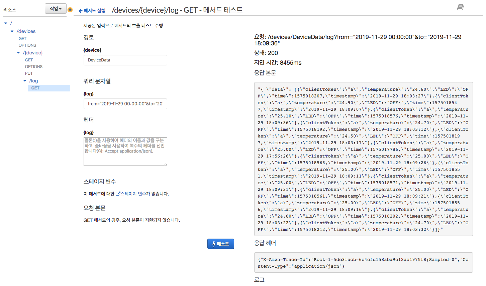
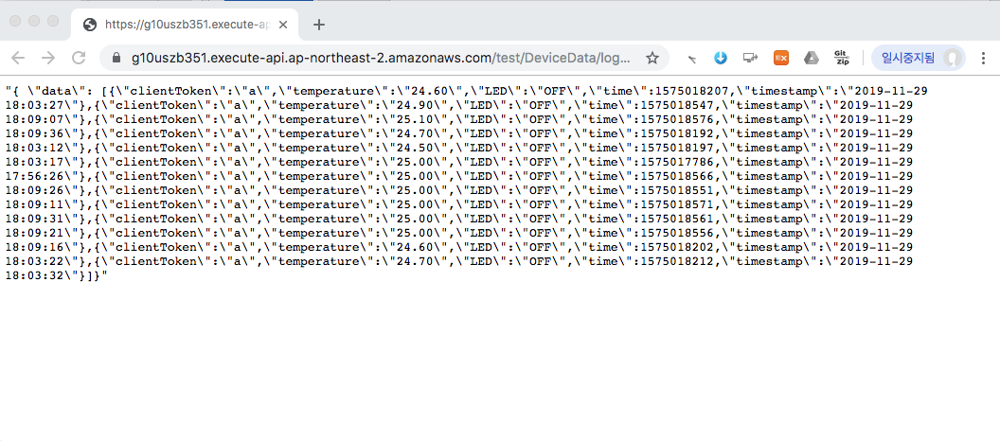

### 3.4 디바이스 로그 조회 REST API 구축하기
- API 요청

	```		
	GET /devices/{deviceId}/log?from=1000&to=2000
	```	
- 응답모델
	
	```json
	{
		"data":[
			{
				"time":timestamp,
				"attributes": {
					"attribute1": integer3,
					"attribute2": "string3",
					...
				}
			},
			...
		]
	}
	```
	 
--
#### 1단계: AWS Toolkit을 통해 Lambda 함수 생성

- [DynamoDB를 이용한 백엔드 구축하기](dynamodb.html) 단원에서 DynamoDB에 디바이스 정보를 저장하는 두 가지 방법을 예시하였습니다. 
	1. [방법1](dynamodb.html#3) : 파티션 키를 가진 테이블에 디바이스 데이터를 저장하는 단순한 사례
	2. [방법2](dynamodb.html#4) : 파티션 키와 정렬 키를 가진 테이블에 디바이스 데이터를 중복 없이 저장하는 사례

- DynamoDB 테이블에 저장된 로그를 읽는 Lambda 함수는 위 두 가지 방법 중 [방법2](dynamodb.html#4)를 사용하여 로그를 저장한 경우를 가정하고 구현되었습니다.
	- [방법2을 통해 저장된 로그 데이터를 읽는 Lambda 함수](api-gateway-3.4-1b.html)
	- [참고] [방법1을 통해 저장된 로그 데이터를 읽는 Lambda 함수](api-gateway-3.4-1a.html)


--	
#### 2단계 API Gateway 콘솔에서 REST API 생성
1. [API Gateway 콘솔](https://ap-northeast-2.console.aws.amazon.com/apigateway/)로 이동합니다.
2. 이전에 생성한 *my-device-api*를 선택합니다.
3. 리소스 이름(**/{device}**)을 선택합니다. 
4. **작업** 드롭다운 메뉴에서 **리소스 생성**을 선택합니다.
5. **리소스 이름**에 *log*를 입력하고, **리소스 생성**을 클릭합니다.
6. **작업** 드롭다운 메뉴에서 **메소드 생성**을 선택합니다.
5. 리소스 이름 (/log) 아래에 드롭다운 메뉴가 보일 것입니다. **GET**을 선택한 후 **확인 표시 아이콘**(체크)을 선택하여 선택 사항을 저장합니다.
6.  **/devices/{device}/log – GET – 설정** 창의 **통합 유형**에서 *Lambda 함수*를 선택합니다.
7. **Lambda 프록시 통합 사용** 상자를 **선택하지 않은 상태**로 놔둡니다.
8. **Lambda 리전**에서 Lambda 함수를 생성한 리전을 선택합니다.
9. **Lambda 함수** 필드에 문자를 입력한 후 드롭다운 메뉴에서 *LogDeviceFunction*을 선택합니다.  **저장**을 선택하여 선택 사항을 저장합니다
10. **Lambda 함수에 대한 권한 추가** 팝업이 나타나면(**Lambda 함수를 호출하기 위해 API Gateway에 권한을 부여하려고 합니다....**”), 확인을 선택하여 API Gateway에 해당 권한을 부여합니다.
	- 이제 **/devices/{device}/log – GET – 메소드 실행** 창이 보일 것입니다.

다음 단계는 API Gateway를 통해 들어오는 클라이언트의 입력을 Lambda 함수에 전달하기 위해서 클라이언트의 입력을 Lambda 함수의 입력으로 매핑하는 과정에 대해서 진행합니다.
	
1. **메서드 실행** 창에서 **메서드 요청**을 선택합니다.
2. **URL 쿼리 문자열 파라미터(URL Query String Parameters)** 섹션을 확장합니다. 
	- **쿼리 문자열 추가(Add query string)**를 선택합니다. 이름에 *from*을 입력합니다. 필수 옵션을 선택하고 확인 표시 아이콘을 선택하여 설정을 저장합니다. 캐싱(Caching)을 비워두어 이 연습에 불필요한 요금 부과를 방지합니다.	
	- **쿼리 문자열 추가(Add query string)**를 선택합니다. 이름에 *to*을 입력하고, 이전과 동일한 과정을 진행합니다.
	

4. /log GET 메서드를 선택하고 **통합 요청(Integration Request)**을 선택하여 본문 매핑 템플릿을 설정합니다. 
	1. **매핑 템플릿(Mapping Templates)** 섹션을 확장합니다. **매핑 템플릿 추가(Add mapping template)**를 선택합니다. **Content-Type**에 *application/json*을 입력합니다. 확인 표시 아이콘을 선택하여 설정을 저장합니다.
		- 나타나는 팝업에서 **예, 이 통합 보호(Yes, secure this integration)**를 선택합니다.
	2. **요청 본문 패스스루(Request body passthrough)**에 권장되는 **정의된 템플릿이 없는 경우(권장)**를 선택합니다.
	3.	매핑 템플릿 편집기에 다음 매핑 스크립트를 입력합니다.

		```json
		{
		  "device": "$input.params('device')",
		  "from": "$input.params('from')",
		  "to":  "$input.params('to')"
		}
		```
	5. **저장**을 선택합니다.

5. **/devices/{device}/log – GET – 메소드 실행** 창으로 이동하여, **클라이언트** 부분의 **테스트**를 클릭합니다.
6. **1단계**에서 Lambda 함수를 만든 방법에 따라 다음과 같이 수행합니다.

	- **방법1**을 사용한 경우: **{device} 경로**에 본인이 만든 사물의 로그 데이터를 기록하는 DynamoDB 테이블 이름(예, DeviceData)을 입력합니다.
	- **방법2**를 사용한 경우: **{device} 경로**에 본인이 만든 사물 이름(예, MyMKRWiFi1010)을 입력합니다.
7. **쿼리 문자열**에 아래와 같은 내용을 입력합니다.

	```
	from="2019-11-29 00:00:00"&to="2019-11-29 18:09:36"
	```
8. **테스트**버튼을 클릭하여 다음과 같은 결과가 나오는 지 확인합니다.

	

--
#### 3단계: CORS 활성환 및 API Gateway 콘솔에서 REST API 배포

REST API 리소스에 대해 CORS 지원 활성화

1. 리소스에서 **리소스**를 선택합니다. 그렇게 하면 리소스 상의 모든 메서드에 대해 CORS가 활성화됩니다.
2. **작업** 드롭다운 메뉴에서 **CORS 활성화(Enable CORS)**를 선택합니다.
3. **CORS 활성화 및 기존의 CORS 헤더 대체**를 선택합니다.
4. **메서드 변경사항 확인** 창에서 **예, 기존 값을 대체하겠습니다.**를 선택합니다.
 
2단계를 완료하면 API를 생성했지만 아직 실제로 사용할 수는 없습니다. 배포해야 하기 때문입니다. 

1. **작업** 드롭다운 메뉴에서 **Deploy API(API 배포)**를 선택합니다.
2. **배포 스테이지** 드롭다운 메뉴에서 **prod**를 선택합니다.
4. **배포**을 선택합니다.

--
#### 4단계: REST API 테스트
1. **prod 스테이지 편집기**의 맨 위에 있는 **호출 URL**을 적어 둡니다.
2. 웹 브라우저 및 [POSTMAN](https://www.getpostman.com/) 등의 도구를 사용하여 테스트 해 봅니다.
	
	```
	https://g10uszb351.execute-api.ap-northeast-2.amazonaws.com/test/DeviceData/log?from=2019-11-29%2000:00:00&to=2019-11-29%2018:09:36
	```
	
	
	
3. [2.4](api-gateway.html#2.4)절에서 정의한 응답 모델과 동일한 형식의 JSon 문자열이 반환된 것을 확인할 수 있습니다.

